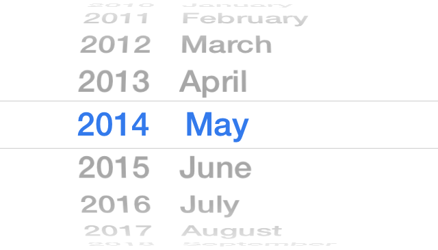

# SRMonthPicker

Like UIDatePicker, but without the days.



This is a native, localised month picker for iOS, licensed under the terms of the [MIT License](http://opensource.org/licenses/mit-license.php).  It's meant to mimic the look, feel & behaviour of 2 UI elements on iOS:

* A monthpicker that appears for an `<input type="month" />` element on iOS Safari
* A UIDatePicker set to Date-only mode, but without the day element.

## Including in your project

The easiest way by far of including this project is to use [CocoaPods](http://cocoapods.org).  Once you've got that up & running for your project, simply add the dependency to your `Podfile`:

```ruby
platform :ios, "5.0"

pod "SRMonthPicker"

```

Then run `pod install` to install the dependencies.

Alternatively, simply clone this project as a submodule or download the classes, and include them in your project.  Bear in mind this library uses ARC, so you should create a Static Library if your project doesn't.

## Usage

For Interface Builder (including Storyboard), simply drag out a `UIPickerView` in Interface Builder.  Under the Assistant Editor, set the class of the picker to `SRMonthPicker`.  If you're building your interfaces by code, it's simply a case of initialising an SRMonthPicker instance & adding a subview.

You have properties to show the year first, along with the setting (& getting) the selected date, plus the maximum & minimum years.

As of version 0.2.5, there is a `SRMonthPickerDelegate`.  This provides 2 optional methods:

* `- (void)monthPickerWillChangeDate:(SRMonthPicker *)monthPicker`
* `- (void)monthPickerDidChangeDate:(SRMonthPicker *)monthPicker`

Because the `delegate` property is used interally, you'll need to assign your delegate to the month picker's `monthPickerDelegate` property.

A simple example project showing off many of the features can be seen [here](https://www.github.com/simonrice/SRMonthPickerExample).  In addition, the header files are fully documented in AppleDoc format - thanks to CocoaDocs, you can see the full documentation [in your browser](http://cocoadocs.org/docsets/SRMonthPicker).

## Contributions

As everyone says, GitHub is about social coding - I didn't just choose to use it because of my love of git as a version control system.  Please do chip in & help make this an even better project.

## License

As stated further up on this page, usage is provided under the [MIT License](http://opensource.org/licenses/mit-license.php).  See the `LICENSE` file or any class header for the full details.
